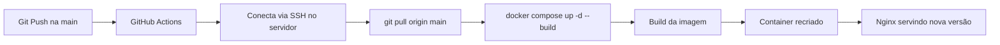

# PROJETO INTEGRADOR — CLOUD & DEVOPS (N1)

### Animais Fantásticos — aplicação web containerizada e publicada em nuvem

**Disciplina:** Cloud Computing & DevOps
**Etapa:** N1 — Construção e implantação do projeto
**Repositório:** <https://github.com/vitorfxp/N1---Animais-F-ntasticos->

---

## Sumário

1. [Objetivo](#1-objetivo)
2. [Integrantes do grupo](#2-integrantes-do-grupo)
3. [A aplicação](#3-a-aplicação)
4. [Arquitetura do ambiente](#4-arquitetura-do-ambiente)
5. [Tecnologias utilizadas](#5-tecnologias-utilizadas)
6. [Estrutura do projeto](#6-estrutura-do-projeto)
7. [Versionamento (Git)](#7-versionamento-git)
8. [Containerização (Docker)](#8-containerização-docker)
9. [Ambiente Cloud](#9-ambiente-cloud)
10. [DNS](#10-dns)
11. [HTTPS](#11-https)
12. [CI/CD](#12-cicd)
13. [Monitoramento](#13-monitoramento)
14. [Segurança](#14-segurança)
15. [Processo de instalação](#15-processo-de-instalação)
16. [Processo de deploy](#16-processo-de-deploy)
17. [Procedimentos de recuperação](#17-procedimentos-básicos-de-recuperação)
18. [Evidências da N1](#18-evidências-da-n1)
19. [Guia de defesa técnica (N2)](#19-guia-de-defesa-técnica-n2)
20. [Licença](#20-licença)

---

## 1. Objetivo

Este projeto aplica de forma prática os conceitos estudados na disciplina de Cloud Computing & DevOps,
cobrindo o ciclo completo de vida de uma aplicação web:

```
Código → Git → Imagem Docker → Container → Cloud → DNS → HTTPS → CI/CD → Monitoramento
```

O foco não é apenas a aplicação web, e sim **todo o processo de infraestrutura** necessário para
levá-la do código até a produção, de forma reprodutível, automatizada, segura e observável.

---

## 2. Integrantes do grupo

| # | Nome completo | GitHub |
|---|---------------|--------|
| 1 | João Vitor Ferreira Ribeiro | [@vitorfxp](https://github.com/vitorfxp) |

> **Obrigatório (requisito 1 da N1):** o `index.html` deve exibir na página inicial a **disciplina**
> e o **nome completo de todos os integrantes**. Verifique o bloco `<footer class="copy">` em
> `index.html` e ajuste para o seu grupo antes da entrega.

---

## 3. A aplicação

**Nome:** Animais Fantásticos
**Tipo:** site estático (HTML, CSS e JavaScript puros)
**Descrição:** uma página institucional/editorial com três seções:

- **Animais** — galeria com abas (Raposa, Esquilo, Urso, Lobo, Babuíno, Leão) com troca de conteúdo por clique;
- **FAQ** — lista de perguntas e respostas em formato acordeão;
- **Contato** — mapa e dados de contato.

**Funcionalidades implementadas em JavaScript puro (`main.js`):**

| Função            | O que faz                                                                 |
|-------------------|---------------------------------------------------------------------------|
| `tabNav()`        | Navegação por abas na galeria de animais                                  |
| `accordionNav()`  | Acordeão da seção de FAQ                                                  |
| `smoothScroll()`  | Rolagem suave entre seções via âncoras do menu                            |
| `scrollAnimation()` | Animações de entrada das seções ao rolar a página                      |

Não há dependências de runtime: o site roda apenas com o navegador.

---

## 4. Arquitetura do ambiente

```
        ┌──────────────┐
        │   Navegador  │  (usuário final)
        └───────┬──────┘
                │ HTTPS :443
                ▼
     ┌──────────────────────┐
     │  DNS (provedor/registro) │  dominio.com ──► IP público do servidor
     └──────────┬───────────┘
                ▼
     ┌──────────────────────┐
     │  Servidor Cloud (VPS) │  Ubuntu + Docker + Traefik
     │  ┌────────────────┐  │
     │  │    Traefik      │  │  reverse proxy + terminação TLS
     │  └───────┬────────┘  │  :80 (redirect) / :443 (HTTPS)
     │          │           │
     │  ┌───────▼────────┐  │
     │  │  Container      │  │  Nginx (porta interna 80)
     │  │  site estático  │  │
     │  └────────────────┘  │
     └──────────────────────┘
```

**Fluxo de uma requisição:**
`Usuário → DNS (domínio → IP) → Traefik (443) → certificado TLS → Container Nginx (80) → HTML/CSS/JS`

**Por que esse desenho:**

- O **Traefik** descobre os containers automaticamente pelas *labels* do Docker Compose — não há
  configuração manual de virtual host;
- O container **não publica portas para a internet** (não usa `ports:`), ficando acessível apenas
  pela rede Docker `traefik`. Só o proxy tem porta aberta — esse é o requisito de
  "evitar exposição desnecessária de portas";
- O **Nginx** serve os arquivos estáticos já embutidos na imagem.

---

## 5. Tecnologias utilizadas

| Camada          | Tecnologia                                     |
|-----------------|------------------------------------------------|
| Front-end       | HTML5, CSS3, JavaScript (vanilla)              |
| Servidor web    | Nginx (dentro do container)                     |
| Containers      | Docker, Docker Compose                          |
| Orquestração    | Reverse proxy Traefik v3 (labels)               |
| Cloud           | VPS / Cloud Server (Ubuntu Server 22.04/24.04)  |
| DNS             | Registro DNS do domínio (A record)              |
| TLS             | Let's Encrypt via certresolver do Traefik       |
| CI/CD           | GitHub Actions                                  |
| Versionamento   | Git + GitHub                                    |
| Monitoramento   | Uptime Kuma                                     |

---

## 6. Estrutura do projeto

```
.
├── .github/
│   └── workflows/
│       └── deploy.yml        # pipeline de CI/CD (GitHub Actions)
├── css/
│   └── style.css             # estilos do site (305 linhas)
├── img/
│   ├── imagem1.jpg … imagem6.jpg
│   └── mapa.png
├── .dockerignore             # arquivos ignorados no build da imagem
├── docker-compose.yml        # definição do serviço + labels do Traefik
├── Dockerfile                # build da imagem (multi-stage implícito: nginx:alpine)
├── index.html                # página única da aplicação
├── main.js                   # interações (tabs, accordion, scroll)
├── LICENSE                   # MIT
└── README.md                 # este documento
```

---

## 7. Versionamento (Git)

O código está versionado em um repositório Git **público**:

```
https://github.com/vitorfxp/N1---Animais-F-ntasticos-
```

**Histórico de commits:**

```
2fc460b | vhbrilhante | 2026-09-29 | FISRT COMMIT
3ee14bc | vhbrilhante | 2026-09-29 | feat estrutura inicial do projeto integrador
```

**Comandos Git usados no projeto:**

```bash
git clone https://github.com/vitorfxp/N1---Animais-F-ntasticos-
cd N1---Animais-F-ntasticos-

git status                    # estado do working tree
git log --oneline --graph     # histórico resumido
git diff                      # alterações não commitadas
git add .                     # adiciona ao staging
git commit -m "msg"           # registra no histórico
git push origin main          # envia para o remoto (dispara a pipeline)
```

**Convenção de mensagens adotada:** prefixos no estilo Conventional Commits
(`feat:`, `fix:`, `docs:`, `chore:`), descrevendo a alteração de forma curta e objetiva.

---

## 8. Containerização (Docker)

### 8.1 Entendendo a cadeia

```
Código (arquivos)  ──docker build──▶  Imagem (template imutável)
                                            │
                                       docker run/compose up
                                            ▼
                                      Container (instância em execução)
                                            ▼
                                      Aplicação servida na porta 80
```

- **Código:** os arquivos `index.html`, `main.js`, `css/`, `img/`.
- **Imagem:** o resultado do `docker build` — um snapshot imutável e versionável do código + servidor.
- **Container:** uma instância em execução da imagem. Se ela for removida (`docker rm`), a **imagem
  continua existindo** e um novo container pode ser criado em segundos — é exatamente o que a
  pipeline faz a cada deploy.

### 8.2 Dockerfile

```dockerfile
FROM nginx:alpine

COPY index.html main.js /usr/share/nginx/html/
COPY css/ /usr/share/nginx/html/css/
COPY img/ /usr/share/nginx/html/img/

EXPOSE 80

CMD ["nginx", "-g", "daemon off;"]
```

**Decisões:**
- `nginx:alpine` — imagem oficial mínima, build rápido e menor superfície de ataque;
- `COPY` apenas do que é necessário — a imagem final não contém `.git`, editor ou arquivos de build;
- `EXPOSE 80` é apenas documentação; quem realmente publica portas é o `docker run -p`;
- `daemon off;` mantém o Nginx no plano de foreground, exigência para o Docker supervisionar o processo.

### 8.3 Docker Compose

```yaml
services:
  animais-fantasticos:
    build: .
    container_name: animais-fantasticos
    restart: unless-stopped
    networks:
      - traefik
    labels:
      - "traefik.enable=true"
      - "traefik.http.routers.animais.rule=Host(`manager01hetzner.infinitymais.com.br`)"
      - "traefik.http.routers.animais.entrypoints=web"
      - "traefik.http.services.animais.loadbalancer.server.port=80"

networks:
  traefik:
    external: true
```

Pontos-chave:
- `build: .` — o Compose constrói a imagem a partir do Dockerfile local;
- `restart: unless-stopped` — **auto-heal**: se o container cair, o Docker o reinicia;
- `networks: traefik (external: true)` — o container entra na rede do Traefik já existente;
- ausência de `ports:` — a aplicação **não** é exposta diretamente, só via proxy.

### 8.4 Comandos de operação

```bash
# Build da imagem
docker build -t animais-fantasticos:1.0 .

# Executar localmente (publicando a porta 8080)
docker run -d --name teste -p 8080:80 animais-fantasticos:1.0

# Subir via Compose
docker compose up -d --build

# Diagnóstico
docker ps                       # containers em execução
docker images                   # imagens construídas
docker logs -f animais-fantasticos
docker inspect animais-fantasticos
docker exec -it animais-fantasticos nginx -t
docker stats                    # consumo de CPU/memória em tempo real

# Remoção do container (a imagem permanece — prova de que são coisas distintas)
docker rm -f animais-fantasticos
docker images | grep animais
```

### 8.5 .dockerignore

```text
.git
.gitignore
.DS_Store
Thumbs.db
*.zip
*.log
node_modules
Dockerfile
.dockerignore
```

Reduz o contexto de build e evita que segredos/artefatos entrem na imagem.

---

## 9. Ambiente Cloud

| Item                        | Valor                                        |
|-----------------------------|----------------------------------------------|
| Provedor                    | VPS / Cloud Server                           |
| IP público                  | `XXX.XXX.XXX.XXX`                            |
| Sistema operacional         | Ubuntu Server (LTS)                          |
| Recursos da máquina         | 2 vCPU · 2 GB RAM · 40 GB SSD                |
| Diretório da aplicação      | `/root/projeto`                              |
| Porta publicada — aplicação | 443 (HTTPS) via Traefik                      |
| Porta publicada — redirec.  | 80 → 443                                     |
| Portas **não** publicadas   | 80 do container (interna), 22 (restrita)     |
| Forma de acesso             | SSH (`ssh root@XXX.XXX.XXX.XXX`) e HTTPS público |

**Justificativa da escolha:** o VPS atende a todos os requisitos (sistema operacional gerenciado,
IP público fixo, freedom para instalar Docker e Traefik, e custo acessível para o projeto acadêmico),
mantendo o controle total sobre a stack — diferente de serviços gerenciados como PaaS, onde o
reverse proxy e a orquestração seriam vinculados ao provedor.

**Acesso ao ambiente (para validação do professor):**

```bash
ssh root@XXX.XXX.XXX.XXX
cd /root/projeto && git pull origin main && docker compose ps
```

---

## 10. DNS

**Domínio utilizado:** `manager01hetzner.infiniymais.com.br:7070` 

**Configuração — registro tipo A:**

```
Nome:    animais
Tipo:    A
Valor:   XXX.XXX.XXX.XXX
TTL:     300
```

## 11. HTTPS

**Mecanismo:** Traefik como *reverse proxy* com emissão automática de certificado via
**Let's Encrypt** (certificados gratuitos, emitidos e renovados pelo próprio proxy).

**Habilitando HTTPS no `docker-compose.yml`** (as linhas já estão prontas e comentadas):

```yaml
labels:
  - "traefik.enable=true"
  - "traefik.http.routers.animais.rule=Host(`manager01hetzner.infinitymais.com.br`)"
  - "traefik.http.routers.animais.entrypoints=websecure"
  - "traefik.http.routers.animais.tls=true"
  - "traefik.http.routers.animais.tls.certresolver=letsencrypt"
```

**Comprovação:**

```bash
# Testar o handshake TLS
curl -I https://manager01hetzner.infinitymais.com.br:7070
openssl s_client -connect manager01hetzner.infinitymais.com.br:7070 -servername manager01hetzner.infinitymais.com.br

# Consultar o certificado emitido (vencedor, validade, SAN)
echo | openssl s_client -servername  manager01hetzner.infinitymais.com.br -connect  manager01hetzner.infinitymais.com.br:7070 2>/dev/null \
  | openssl x509 -noout -issuer -subject -dates
```

O TLS garante **criptografia em trânsito**, integridade das mensagens e autenticação do servidor —
 impedindo interceptação e o aviso de navegador "Not Secure".

---

## 12. CI/CD

**Ferramenta:** GitHub Actions — arquivo `.github/workflows/deploy.yml`.

**Gatilho:** qualquer `push` na branch `main`.



**Configuração do workflow:**

```yaml
name: Deploy Contínuo
on:
  push:
    branches: [ "main" ]
jobs:
  deploy:
    runs-on: ubuntu-latest
    steps:
      - name: Executar Deploy via SSH
        uses: appleboy/ssh-action@v1.0.3
        with:
          host: XXX.XXX.XXX.XXX
          username: root
          password: ${{ secrets.SSH_PASSWORD }}
          script: |
            cd /root/projeto
            git pull origin main
            docker compose up -d --build
```

**Segurança da pipeline:** a senha SSH **nunca** fica no código. Ela é armazenada em
**GitHub Secrets** (`Settings → Secrets and variables → Actions → New repository secret`), e
referenciada como `${{ secrets.SSH_PASSWORD }}`. O arquivo YAML no repositório só exibe o nome da
variável. Os logs da execução ficam ofuscados.

**Demonstração ao vivo sugerida (N2):**

```bash
# 1. alterar index.html (ex.: texto do rodapé)
vim index.html

# 2. commitar e enviar
git add index.html
git commit -m "docs: atualiza rodapé com data da apresentação"
git push origin main

# 3. observar a execução em → GitHub, aba "Actions" (status: in progress → completed)
# 4. recarregar https://manager01hetzner.infinitymais.com.br:7070 e ver a mudança
```

O que muda em produção, na prática:
- **imagem nova** construída a partir do código novo (`--build`);
- **container recriado** — o antigo é destruído e um novo sobe em segundos;
- downtime de poucos segundos, sem perder a imagem anterior (a que estiver em uso durante o
  `docker compose up` só é removida após o novo container estar pronto).

---

## 13. Monitoramento

**Ferramenta:** Uptime Kuma (rodando em container no mesmo servidor, ou em serviço externo).

| Verificação                    | Como fazer                                                                 |
|--------------------------------|---------------------------------------------------------------------------|
| A aplicação está online?        | `curl -I https://manager01hetzner.infinitymais.com.br:7070` retorna `200 OK`                 |
| O servidor está funcionando?   | `uptime`, `top`, `free -h`, `df -h`                                       |
| O container está funcionando?   | `docker ps` (coluna `STATUS` = `Up X minutes`)                            |
| Recursos sob pressão?          | `docker stats`, `htop`                                                     |
| Certificado SSL válido?        | `docker logs traefik` mostra a emissão/renovação                           |

**Configurar um monitor de disponibilidade:**

1. Instalar o Uptime Kuma: `docker run -d --restart=always -p 3001:3001 -v uptime-kuma:/app/data --name uptime-kuma louislam/uptime-kuma:1`;
2. Acessar `http://IP_SERVIDOR:3001` e criar conta de administrador;
3. Criar monitor do tipo **HTTP(S)** apontando para `https://manager01hetzner.infinitymais.com.br:7070`;
4. Configurar alertas (e-mail/Telegram/Discord) e o intervalo de verificação (ex.: 60 s);
5. Opcional: monitorar o container via `docker exec uptime-kuma sh -c "docker ps"`.

**Cenário de indisponibilidade e como é diagnosticado:**

| Sinal                                        | Causa provável                      | Correção |
|----------------------------------------------|-------------------------------------|----------|
| Monitor HTTP retorna `down`                  | container parado                    | `docker compose up -d` + `docker logs` |
| HTTP 502/503 pelo proxy                      | container rodando, app não responde| `docker logs`, testar porta 80 interna |
| `ERR_NAME_NOT_RESOLVED`                      | registro DNS ausente/errado         | corrigir A record, aguardar TTL |
| `ERR_CONNECTION_REFUSED`                     | porta fechada ou serviço parado     | `ss -tulnp`, status do Docker |
| Certificado inválido                         | certresolver falhou                 | `docker logs traefik`, validar e-mail/DNS |

---

## 14. Segurança

| Medida                                    | Situação no projeto                                                        |
|-------------------------------------------|----------------------------------------------------------------------------|
| Não expor portas desnecessárias           | Container **sem** `ports:` — só o Traefik (443/80) é público              |
| HTTPS obrigatório                         | TLS gerenciado pelo Traefik com Let's Encrypt                              |
| Credenciais fora do código                | Senha SSH em GitHub Secrets; nada secreto no repositório                    |
| `.dockerignore`                           | Artefatos e `.git` fora do contexto de build                                |
| Autenticação no acesso ao servidor         | SSH por chave é a evolução recomendada (ver observações abaixo)             |
| Auto-heal                                 | `restart: unless-stopped`                                                  |
| Firewall                                  | UFW, permitindo apenas 22/80/443 *(ajustar conforme configuração real)*      |

### Recomendações de evolução (bônus na N2)

1. **Trocar senha SSH por par de chaves** — remover `password:` do workflow e usar `key:`:
   ```bash
   ssh-keygen -t ed25519 -C "github-actions"
   cat ~/.ssh/id_ed25519.pub   # adicionada em ~/.ssh/authorized_keys no servidor
   ```
   Depois no workflow: `key: ${{ secrets.SSH_PRIVATE_KEY }}` e `fingerprint: ...`.
   Isso elimina um segredo reutilizado e torna o acesso auditável e revogável.
2. **Usuário não-root** — criar `deploy` com `sudo` restrito apenas ao `docker compose`, em vez de
   `root`, reduzindo o impacto de um comprometimento.
3. **Firewall (UFW)**:
   ```bash
   ufw default deny incoming
   ufw allow 22/tcp     # restrinja o IP de origem se possível
   ufw allow 80,443/tcp
   ufw enable
   ```
4. **Fail2ban** contra tentativas de brute force no SSH.
5. **Rate limiting** no proxy e cabeçalhos `Strict-Transport-Security`, `X-Content-Type-Options`.
6. **Nunca commitar `.env`**, senhas ou chaves — adicioná-los ao `.gitignore`.

---

## 15. Processo de instalação

### 15.1 Requisitos

- Docker Engine ≥ 20.10 (`docker --version`)
- Docker Compose v2 (`docker compose version`)
- Git

### 15.2 Execução local

```bash
git clone https://github.com/vitorfxp/N1---Animais-F-ntasticos-
cd N1---Animais-F-ntasticos-

# Subir a aplicação
docker compose up -d --build

# Conferir
docker compose ps
curl -I http://localhost
```

### 15.3 Instalação do servidor do zero (documentação do deploy)

```bash
# 1. Atualizar o sistema
apt update && apt upgrade -y

# 2. Instalar Docker (repositório oficial)
apt install -y ca-certificates curl gnupg
curl -fsSL https://get.docker.com | sh
systemctl enable --now docker

# 3. Instalar Docker Compose v2
apt install -y docker-compose-plugin

# 4. Instalar o Traefik como reverse proxy
docker run -d -p 80:80 -p 443:443 \
  -v /var/run/docker.sock:/var/run/docker.sock:ro \
  -v traefik-certs:/traefik/certs \
  --name traefik traefik:v3.0

# 5. Clonar o projeto
mkdir -p /root/projeto && cd /root/projeto
git clone https://github.com/vitorfxp/N1---Animais-F-ntasticos- .

# 6. Subir o serviço
docker compose up -d --build
docker compose ps
```

---

## 16. Processo de deploy

O deploy é **totalmente automatizado** — o caminho do código até a produção é o mesmo para qualquer
integrante do grupo:

```
git push (branch main)  →  GitHub Actions  →  SSH no servidor
                          →  git pull       →  docker compose up -d --build
                          →  https://dominio já atualizado
```

**Deploy manual (fallback, se a pipeline falhar):**

```bash
ssh root@XXX.XXX.XXX.XXX
cd /root/projeto
git pull origin main
docker compose up -d --build
docker compose logs -f
curl -I https://manager01hetzner.infinitymais.com.br:7070
```

**Rollback** para a versão anterior:

```bash
docker images | grep animais        # localizar a tag antiga
docker tag animais-fantasticos:<tag-anterior> animais-fantasticos:latest
docker compose up -d
# ou, a partir do código: git revert <commit> && git push origin main
```

---

## 17. Procedimentos básicos de recuperação

### 17.1 Aplicação fora do ar

```bash
curl -I https://manager01hetzner.infinitymais.com.br:7070    # reproduzir o sintoma
docker compose ps                           # o serviço está Up?
docker compose logs --tail=100              # o que o container diz?
```

### 17.2 Container parado ou reiniciando

```bash
docker ps -a                                # olhar o STATUS (Exited / Restarting)
docker inspect animais-fantasticos --format '{{.State.ExitCode}} {{.State.Error}}'
docker logs --tail=50 animais-fantasticos
docker compose up -d --force-recreate       # recriar o container
```

Causas frequentes: erro de sintaxe na configuração, arquivo deletado do contexto de build, ou
porta em uso.

### 17.3 Problema no reverse proxy / HTTP 502

```bash
docker logs traefik | tail -50
docker exec traefik wget -qO- http://animais-fantasticos:80   # o app responde na rede interna?
docker network inspect traefik                                # os dois estão na mesma rede?
```

### 17.4 Problema de DNS

```bash
dig manager01hetzner.infinitymais.com.br +short   # resolve para 178.156.193.212?
```

Se resolver para o IP errado → corrigir o registro A e aguardar o TTL. Se não resolver → verificar
se o domínio está ativo e propagado.

### 17.5 Problema de HTTPS / certificado inválido

```bash
docker logs traefik | grep -i -E "acme|certificate|error"
```

Causas típicas: e-mail do ACME não configurado, DNS não propagado, porta 80 fechada, ou taxa de
emissão do Let's Encrypt excedida.

### 17.6 Falta de espaço em disco

```bash
df -h
docker system df
docker system prune -a --volumes        # ⚠ remover imagens não usadas
```

### 17.7 Recuperação completa do servidor

```bash
# 1. Acessar via console/IP do provedor se o SSH falhar
# 2. Verificar serviços
systemctl status docker
# 3. Reconstruir o ambiente do zero
cd /root/projeto && git pull origin main
docker compose up -d --build
```

---

## 18. Evidências da N1

| Item obrigatório                        | Onde estão / como gerar                                              |
|-----------------------------------------|-----------------------------------------------------------------------|
| Link do repositório Git                 | Seção 7                                                               |
| URL da aplicação funcionando            | https://manager01hetzner.infinitymais.com.br                          |
| Documentação do projeto                 | este `README.md`                                                      |
| Evidências do ambiente Cloud            | `uname -a`, `cat /etc/os-release`, `lsblk`, `free -h`, `ip a`, `df -h` |
| Evidências do Docker                    | `docker images`, `docker ps`, `docker history`, `docker inspect`      |
| Evidências da pipeline CI/CD            | aba **Actions** no repositório → execução "Deploy Contínuo"           |
| Evidências do monitoramento             | painel do Uptime Kuma com o monitor ativo                             |

> **Importante:** não basta print. O ambiente deve estar **no ar** e disponível para validação do
> professor durante e após a entrega.

---

## 19. Guia de defesa técnica (N2)

Respostas rápidas às perguntas mais prováveis do professor.

**Por que Docker?**
Padroniza o ambiente (a aplicação roda igual na minha máquina, no servidor e em qualquer outro lugar),
empacota a aplicação com suas dependências, isola o processo, permite reprodutibilidade com um único
arquivo e facilita o deploy contínuo.

**Diferença entre imagem e container?**
A **imagem** é o modelo imutável (read-only) gerado pelo `docker build`. O **container** é a instância
em execução da imagem — uma camada de escrita por cima dela. Many containers podem sair da mesma imagem.

**O que acontece quando o container é removido?**
O processo e o que estava gravado no *filesystem do container* são perdidos. A **imagem permanece**
no host, então recriar é instantâneo: `docker compose up -d`. Por isso o estado que importa fica em
volumes ou em banco de dados externo, nunca dentro do container. Com `restart: unless-stopped`, um
container que cai por erro é reiniciado automaticamente.

**Como o domínio chega até o servidor?**
O navegador resolve o nome no DNS (registro A) e obtém o IP `XXX.XXX.XXX.XXX`. Em seguida abre uma
conexão TCP na porta 443 desse IP. O Traefik, escutando em 443, valida o hostname contra as *labels*
dos containers, termina o TLS e encaminha a requisição ao container na porta 80.

**Onde está configurado o HTTPS?**
No Traefik — que é quem termina TLS. Os containers da aplicação só falam HTTP na rede interna. O
certificado é obtido pelo `certresolver` do Traefik via Let's Encrypt (ACME), com renovação
automática, e as opções ficam nas *labels* do `docker-compose.yml` (`tls=true`,
`tls.certresolver=letsencrypt`, `entrypoints=websecure`).

**Como funciona a pipeline / o que acontece no `git push`?**
O push para a `main` dispara o workflow `deploy.yml`. O runner do GitHub Actions se conecta ao
servidor por SSH usando o segredo armazenado no GitHub, executa `git pull origin main` e
`docker compose up -d --build`. Isso reconstrói a imagem com o código novo, recria o container e o
Tráefik passa a servir a nova versão. Em caso de falha em qualquer etapa, o workflow fica vermelho e
a versão anterior continua no ar (a pipeline é "fail-safe", não "fail-fast").

**Onde estão armazenadas as credenciais?**
No GitHub Secrets (criptografadas, inacessíveis no repositório e mascaradas nos logs). Não há senha,
chave ou `.env` versionado no Git. Só o nome da variável aparece no YAML.

**Quais portas estão abertas?**
80 ( redireciona para HTTPS) e 443 (HTTPS) no servidor, e 22 (SSH, restrito). A porta 80 do container
**não** é publicada — o tráfego entre proxy e aplicação acontece na rede Docker interna.

**Como identificariam uma aplicação fora do ar?**
Pelo monitor do Uptime Kuma (alerta automático) e por verificação manual: `curl -I` na URL
(DNS vs. conexão vs. HTTP status), `docker ps` para ver o container, `docker logs` para a causa.
A ordem de diagnóstico é sempre: **DNS → porta aberta → processo ativo → aplicação respondendo**.

**Se o servidor parar, como recuperam o ambiente?**
Console do provedor → reiniciar a VM → validar Docker/Traefik → `cd /root/projeto && git pull origin
main && docker compose up -d --build`. Todo o estado necessário está no Git, exceto a configuração do
Traefik e o certificado (que podem ser recriados em minutos). Backup do Docker volume é recomendado.

**Qual é o ponto único de falha?**
O servidor único: se a VPS cair, site, DNS e monitoramento unavailable. Além disso, a rede Docker e o
Traefik são dependências críticas, e o disco cheio derruba tudo.

**Como tornar mais resiliente?**
- réplicas do container em nós distintos e balanceamento (ex.: 2 VPS + Nginx/HAProxy ou Docker Swarm);
- health checks (`healthcheck` no Compose) e restart policy em todos os serviços;
- banco de dados gerenciado e com backup automático;
- alertas e escalonamento (o Uptime Kuma já cobre disponibilidade);
- snapshot/imagem da VM e Infrastructure as Code (Terraform/Ansible) para recriação rápida;
- CDN/Cloudflare na frente para absorver DDoS e servir o certificado.

---

## 20. Licença

Projeto sob a licença **MIT** — veja [LICENSE](LICENSE).

Desenvolvido como entrega da **N1 do Projeto Integrador — Cloud Computing & DevOps**.
